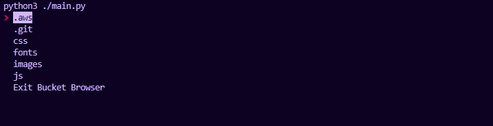
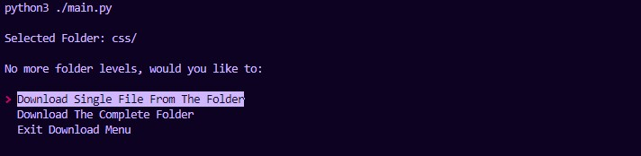

# Python S3 Bucket Explorer

This is a comand line interface written in python that allows browsing of an AWS S3 bucket. It can download files, or even entire folders.

## Description

This code can be incorporated into a larger CLI project to give easier access to an S3 bucket, or it can be used as a standalone interface to easily fetch files or folders from the S3 bucket.


## Interface

After running the script you will see the files in the main directory of the bucket



Once you select a folder you will get a prompt ask ing what you would like to do



You can select a single file to download and it will download into the currect directory


If you want to download the whole folder, it will tell you how many files there are and prompt for confirmation before downloading

The files will be downloaded into a folder of the same name as the last one selected in the bucket


## Configuration

In the top of the [script](./main.py) you need to point it at the aws profile and bucket you want to explore.

```python
bucket_name = '<bucket name>'
aws_profile = '<aws profile name>'
```


## Running The Code

```bash
python3 ./main.py
```

## Ideas For Improvements

For my purposes this was all I needed. 

But if you wanted to improve it;

You could add another menu at the start that let's the user select the bucket to access. Then you could browse any bucket in an acccount.

You could add the ability to upload files to the S3.

You could have a preview of the files in a folder instead of just going directly to downloading them all.